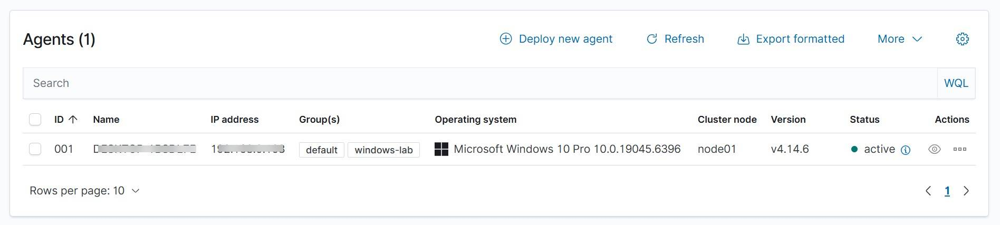
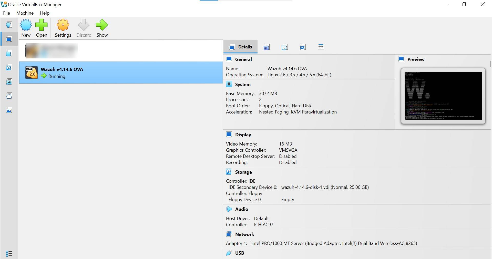

# Lab 1 — Wazuh Server Deployment & Windows Agent Enrollment

## Objective
Deploy a Wazuh SIEM server and enroll a Windows endpoint as a monitored
agent, establishing the foundation for all subsequent labs.

## What I Did
- Deployed the official Wazuh 4.14.6 virtual appliance (OVA) in VirtualBox
- Configured networking so the server and Windows endpoint could communicate
- Accessed the Wazuh dashboard and generated a Windows agent installation command
- Installed and enrolled the Windows endpoint as a monitored agent
- Verified the agent reached **"Active"** status and was sending telemetry to the server

## Skills Demonstrated
- VM/appliance deployment (VirtualBox, OVA import)
- Wazuh agent enrollment workflow
- Network/port verification (agent-manager communication, ports 1514/1515)
- Basic dashboard navigation (Agents management)

## Evidence

**Wazuh Agents page — endpoint enrolled and Active:**

**Wazuh Server VM running in VirtualBox:**

*(Hostnames and IP addresses redacted for privacy.)*

## Key Takeaway
Reliable telemetry is the foundation of any SOC — before investigating
alerts or detecting threats, you need to confirm, not assume, that
endpoint data is actually reaching the central platform.
