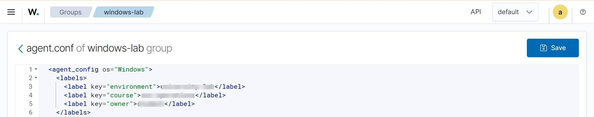

# Lab 2 — Agent Groups & Centralized Configuration

## Objective
Manage endpoint configuration centrally through Wazuh agent groups instead
of configuring each agent individually.

## What I Did
- Created a custom agent group (`windows-lab`) in the Wazuh dashboard
- Assigned the Windows endpoint (enrolled in Lab 1) to the group
- Pushed a centralized configuration (searchable labels) to the group
- Verified the agent synchronized the shared configuration
- Confirmed the label was searchable in Threat Hunting

## Skills Demonstrated
- Centralized policy management via agent groups
- `agent.conf` shared configuration distribution
- Configuration verification (not just applying a change, but confirming it propagated)

## Evidence

**Wazuh agent group configuration:**

*(Hostnames and IP addresses redacted for privacy.)*

## Key Takeaway
Real SOC environments manage configuration at scale through groups and
shared policies, not one endpoint at a time. Applying a change is only
half the job — verifying it actually synced to the endpoint is what
separates "configured" from "assumed configured."
