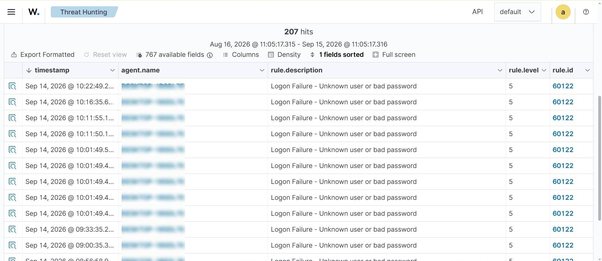

# Lab 3 — Windows Security Events & Failed Logon Detection

## Objective
Trace a Windows authentication failure from the raw OS event log into a
correlated Wazuh SIEM alert, validating that endpoint telemetry is being
parsed and matched correctly.

## What I Did
- Created a temporary local test account
- Simulated 3–5 failed logon attempts against it using `runas`
- Located the resulting event (Event ID 4625 — "An account failed to log on")
  in Windows Event Viewer, noting the account name and timestamp
- Searched Wazuh Threat Hunting for the same event using
  `data.win.system.eventID:4625`
- Located the correlated alert (rule.description: "Logon Failure - Unknown
  user or bad password", rule.id 60122) and compared its fields against
  the original Windows event
- Cleaned up the temporary test account afterward

## Skills Demonstrated
- Windows Security event auditing (Event ID 4625)
- Wazuh Threat Hunting query syntax
- Manual log correlation (raw OS log ↔ SIEM alert)
- Basic incident hygiene (removing test artifacts after the exercise)

## Evidence

**Wazuh Threat Hunting — correlated failed logon alerts:**

*(Hostnames redacted for privacy.)*

## Key Takeaway
A SIEM alert is only useful if you trust that it accurately reflects what
happened on the endpoint. Manually tracing one event end to end — from
the raw Windows log to the SIEM's parsed alert — is how you build that
trust instead of assuming the pipeline works.
