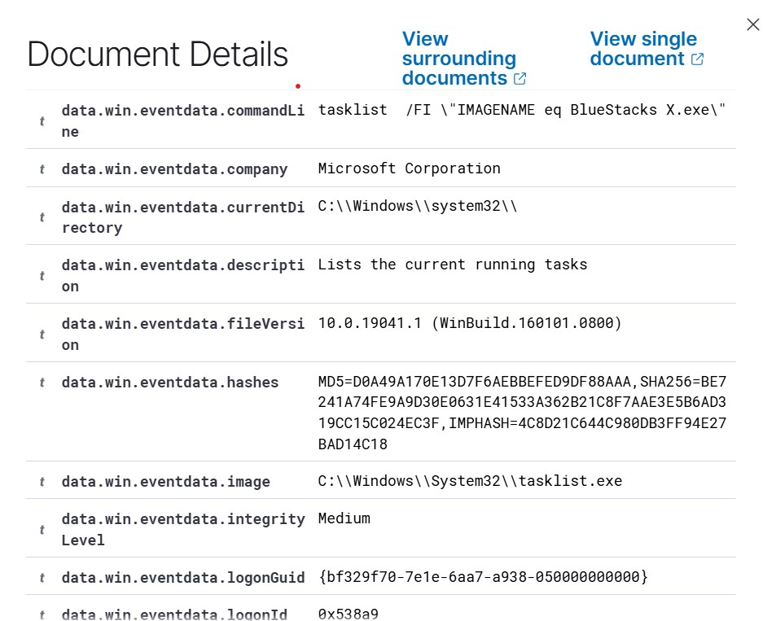
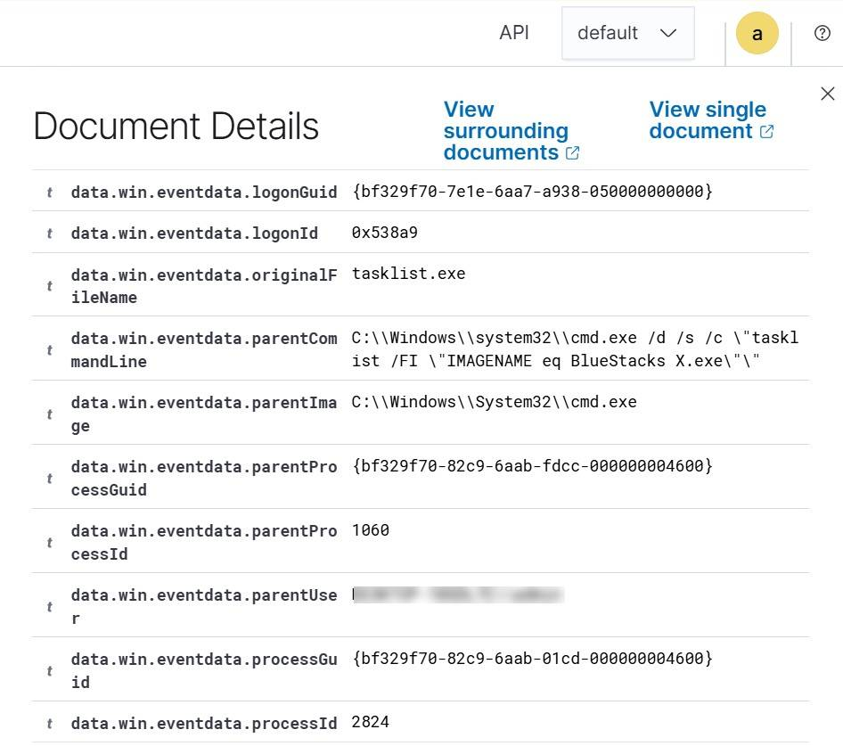

# Lab 4 — Sysmon Installation & Process Event Monitoring

## Objective
Extend endpoint visibility beyond default Windows logging by deploying
Sysmon and integrating its telemetry into Wazuh, then validating
process-creation events end to end.

## What I Did
- Downloaded Sysmon and a documented configuration file
- Installed Sysmon on the Windows endpoint (`Sysmon64.exe -accepteula -i <config>`)
- Verified events were being logged locally in Event Viewer
  (Applications and Services Logs > Microsoft > Windows > Sysmon > Operational)
- Added a `<localfile>` block to the Wazuh agent group configuration to
  forward the Sysmon Operational channel
- Restarted the agent and generated test process activity
- Located and validated the resulting Event ID 1 (process creation) in
  Wazuh, recording Image, CommandLine, ParentImage, and ProcessId

## Troubleshooting
Two real issues came up during this lab, both resolved by reading agent logs:
- **Agent-to-manager disconnection** after the Wazuh server's IP address
  changed — fixed by updating the `<server><address>` value in the local
  `ossec.conf` and restarting the agent service.
- **Clock drift** between the endpoint and the Wazuh server was causing
  narrow time-range searches (e.g. "Last 15 minutes") to silently miss
  events — resolved by widening the search window and noting this as a
  standing consideration for future searches.

## Skills Demonstrated
- Sysmon deployment with a documented configuration
- Custom event channel forwarding via agent group config
- Endpoint telemetry validation (Event ID 1 field interpretation)
- Log-based troubleshooting (agent connectivity, clock drift)

## Evidence

**Wazuh Threat Hunting — Sysmon process-creation event (expanded fields):**

*(Hostnames/usernames redacted for privacy.)*

## Key Takeaway
Out-of-the-box Windows logging isn't enough for real detection work — Sysmon's
process-level detail (what ran, with what command line, launched by what
parent) is foundational to spotting malicious execution. Just as valuable:
the connectivity and clock-drift issues were a real lesson in diagnosing
telemetry pipelines through logs rather than assuming they "just work."
